# DESIGN.md Sample Homepage Gallery

[awesome-design-md](https://github.com/VoltAgent/awesome-design-md) の DESIGN.md を使って生成した **54 種類** のサンプルランディングページ集です。各ブランドのデザインシステム（カラーパレット、タイポグラフィ、コンポーネント仕様）を忠実に再現した、完全自己完結型の HTML ファイルで構成されています。

## Gallery

> 各画像をクリックすると拡大表示できます。

<table>
<tr>
<td align="center" width="25%"><a href="screenshots/apple.png">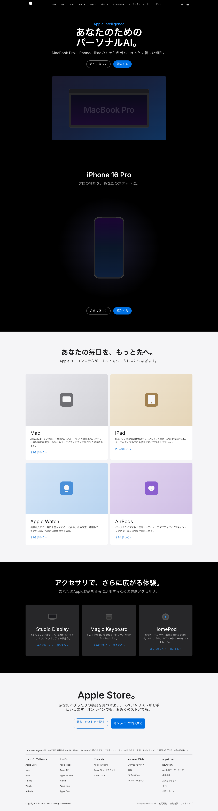</a><br><strong>Apple</strong></td>
<td align="center" width="25%"><a href="screenshots/stripe.png">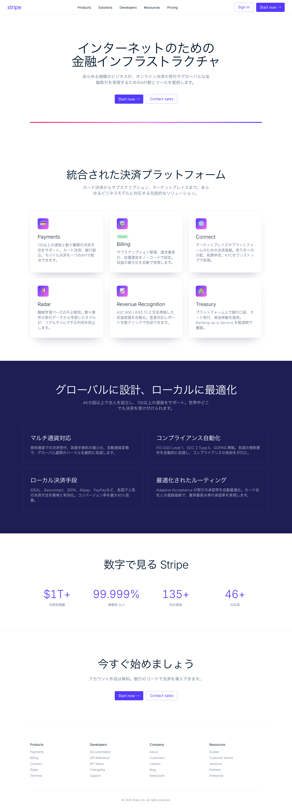</a><br><strong>Stripe</strong></td>
<td align="center" width="25%"><a href="screenshots/vercel.png">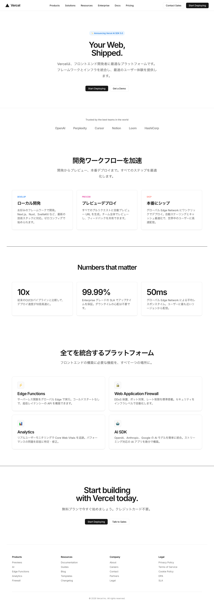</a><br><strong>Vercel</strong></td>
<td align="center" width="25%"><a href="screenshots/linear.png">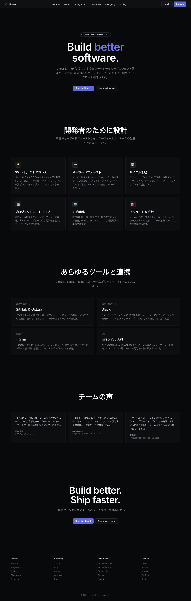</a><br><strong>Linear</strong></td>
</tr>
<tr>
<td align="center"><a href="screenshots/spotify.png">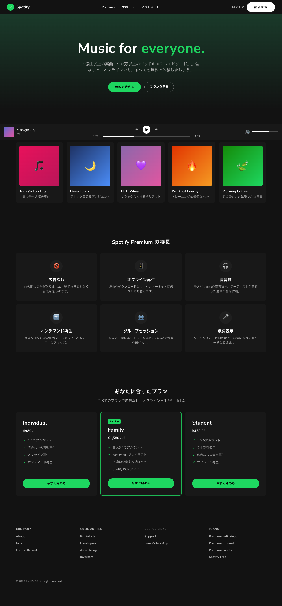</a><br><strong>Spotify</strong></td>
<td align="center"><a href="screenshots/airbnb.png">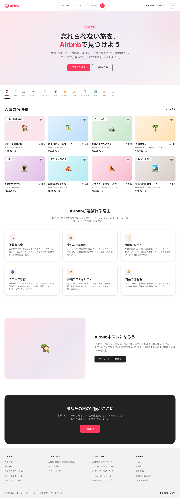</a><br><strong>Airbnb</strong></td>
<td align="center"><a href="screenshots/figma.png">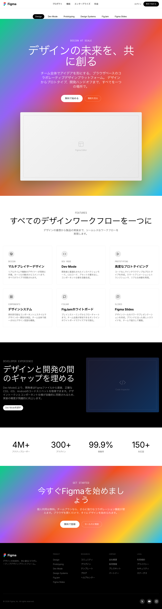</a><br><strong>Figma</strong></td>
<td align="center"><a href="screenshots/notion.png">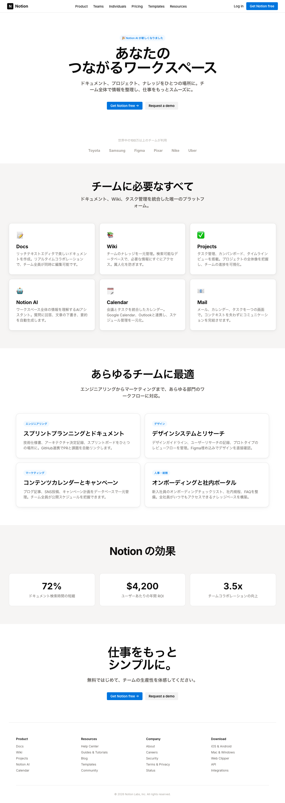</a><br><strong>Notion</strong></td>
</tr>
</table>

<details>
<summary><strong>AI & Machine Learning (12)</strong></summary>
<br>
<table>
<tr>
<td align="center" width="25%"><a href="screenshots/claude.png">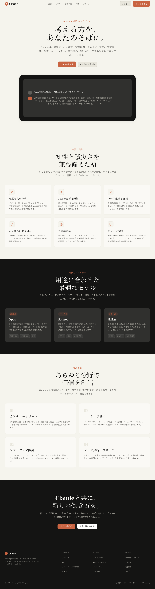</a><br><strong>Claude</strong></td>
<td align="center" width="25%"><a href="screenshots/cohere.png">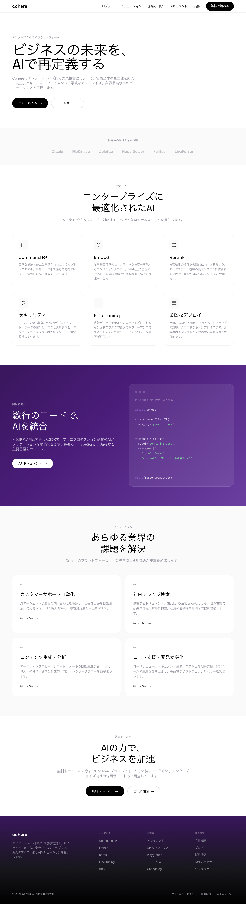</a><br><strong>Cohere</strong></td>
<td align="center" width="25%"><a href="screenshots/elevenlabs.png">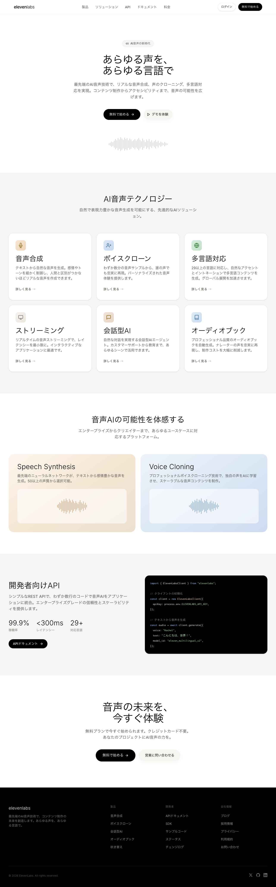</a><br><strong>ElevenLabs</strong></td>
<td align="center" width="25%"><a href="screenshots/minimax.png">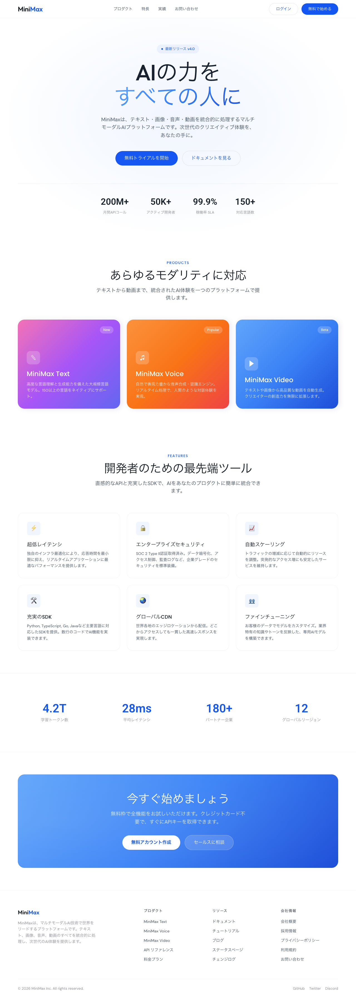</a><br><strong>MiniMax</strong></td>
</tr>
<tr>
<td align="center"><a href="screenshots/mistral.ai.png">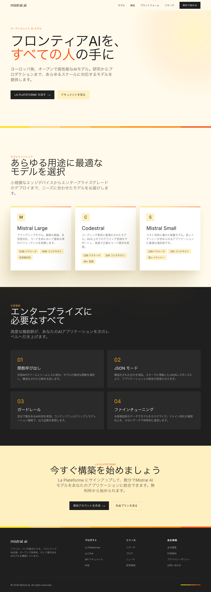</a><br><strong>Mistral AI</strong></td>
<td align="center"><a href="screenshots/ollama.png">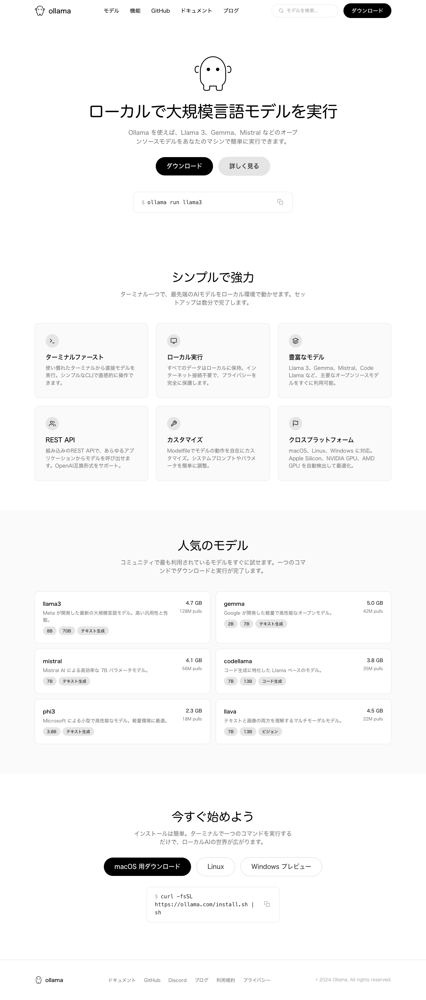</a><br><strong>Ollama</strong></td>
<td align="center"><a href="screenshots/opencode.ai.png">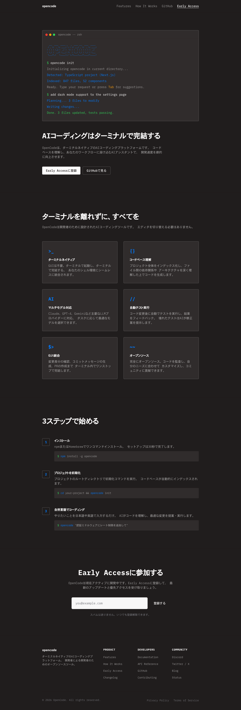</a><br><strong>OpenCode</strong></td>
<td align="center"><a href="screenshots/replicate.png">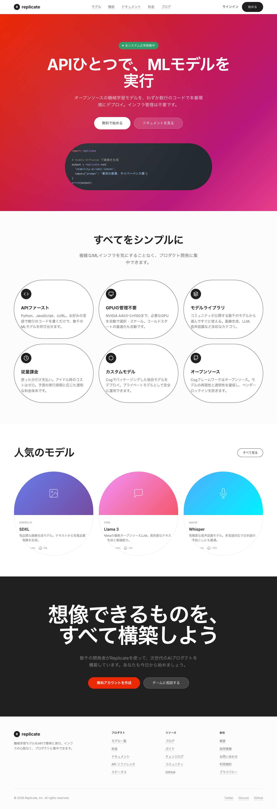</a><br><strong>Replicate</strong></td>
</tr>
<tr>
<td align="center"><a href="screenshots/runwayml.png">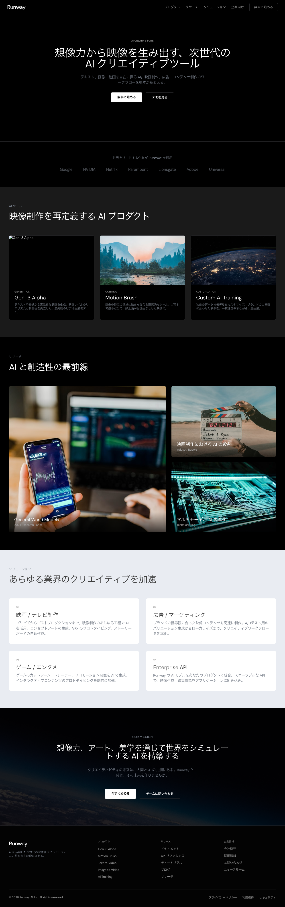</a><br><strong>Runway</strong></td>
<td align="center"><a href="screenshots/together.ai.png">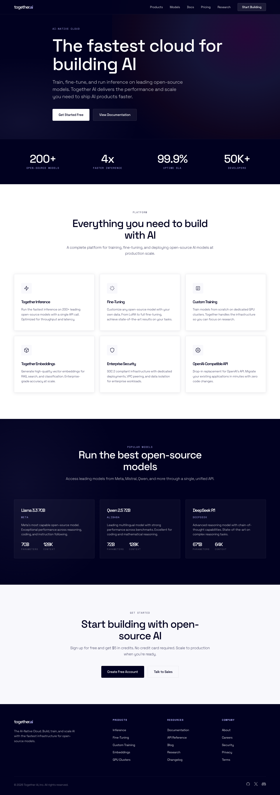</a><br><strong>Together AI</strong></td>
<td align="center"><a href="screenshots/voltagent.png">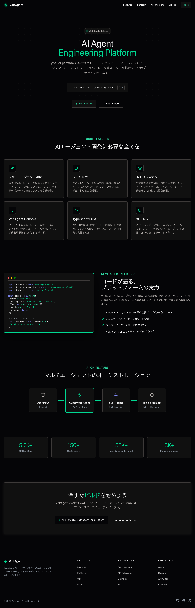</a><br><strong>VoltAgent</strong></td>
<td align="center"><a href="screenshots/x.ai.png">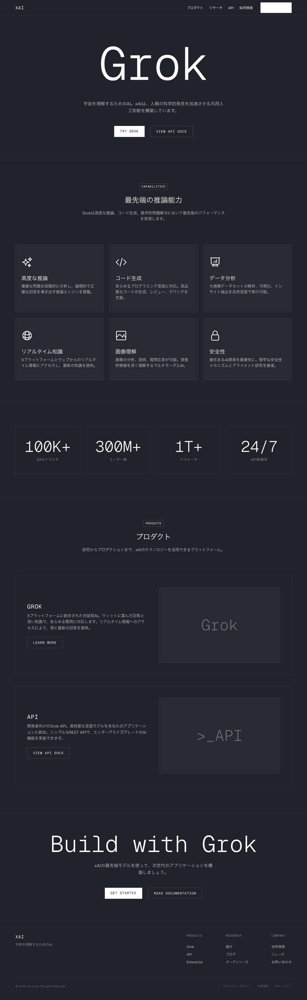</a><br><strong>xAI</strong></td>
</tr>
</table>
</details>

<details>
<summary><strong>Developer Tools & Platforms (13)</strong></summary>
<br>
<table>
<tr>
<td align="center" width="25%"><a href="screenshots/cursor.png">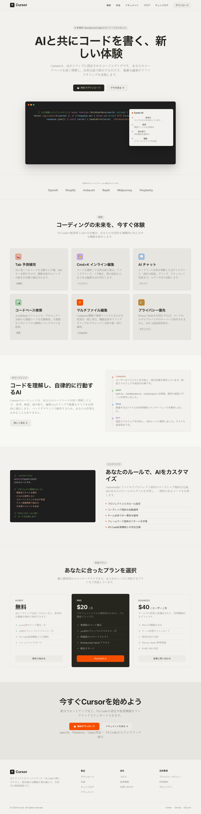</a><br><strong>Cursor</strong></td>
<td align="center" width="25%"><a href="screenshots/expo.png">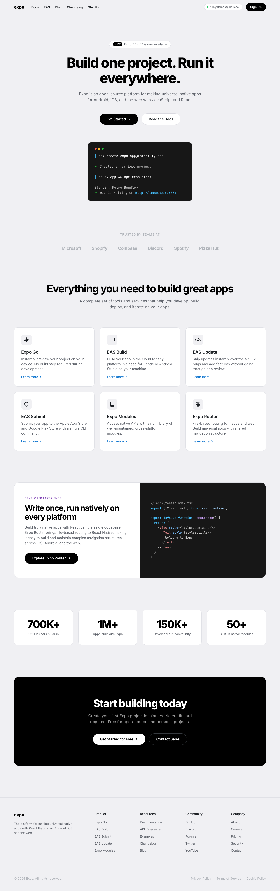</a><br><strong>Expo</strong></td>
<td align="center" width="25%"><a href="screenshots/linear.png"></a><br><strong>Linear</strong></td>
<td align="center" width="25%"><a href="screenshots/lovable.png">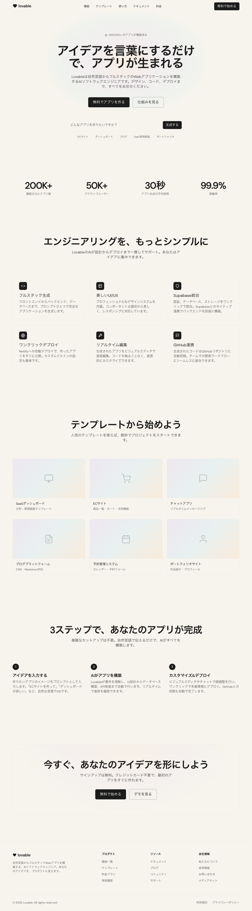</a><br><strong>Lovable</strong></td>
</tr>
<tr>
<td align="center"><a href="screenshots/mintlify.png">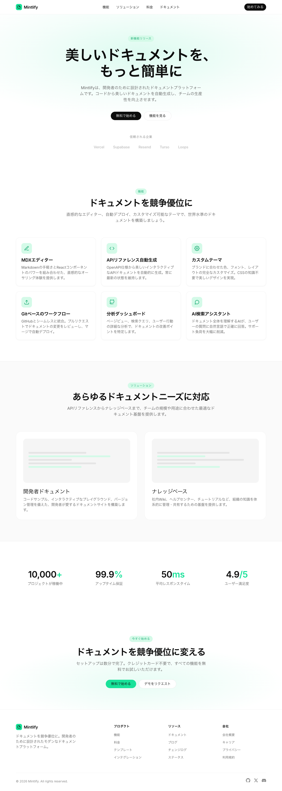</a><br><strong>Mintlify</strong></td>
<td align="center"><a href="screenshots/posthog.png">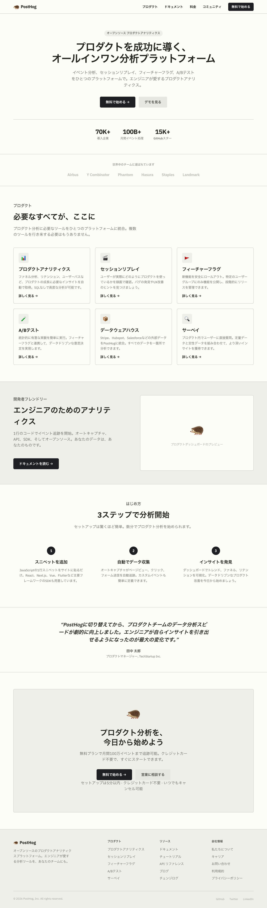</a><br><strong>PostHog</strong></td>
<td align="center"><a href="screenshots/raycast.png">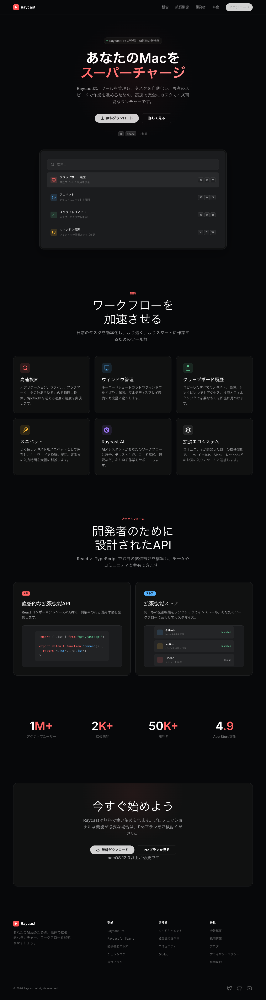</a><br><strong>Raycast</strong></td>
<td align="center"><a href="screenshots/resend.png">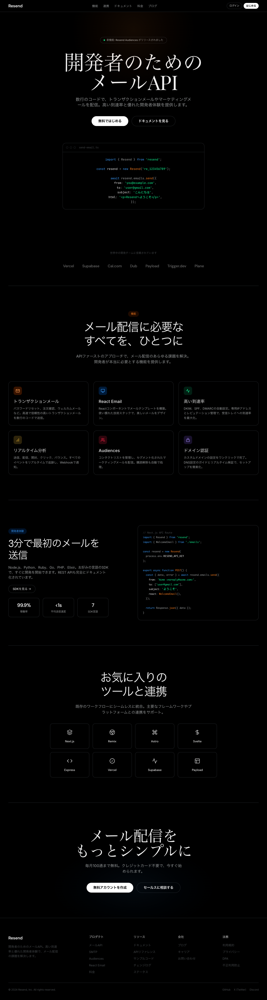</a><br><strong>Resend</strong></td>
</tr>
<tr>
<td align="center"><a href="screenshots/sentry.png">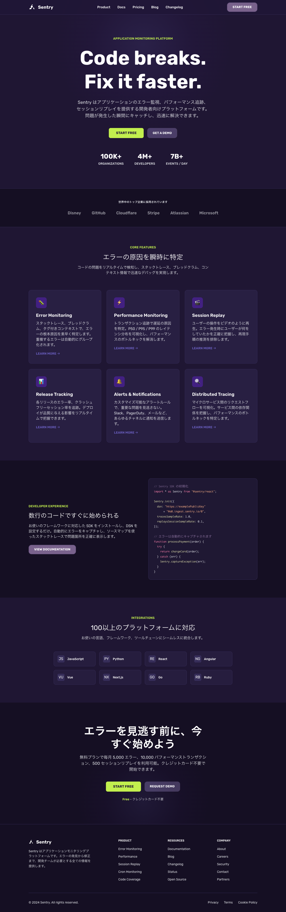</a><br><strong>Sentry</strong></td>
<td align="center"><a href="screenshots/supabase.png">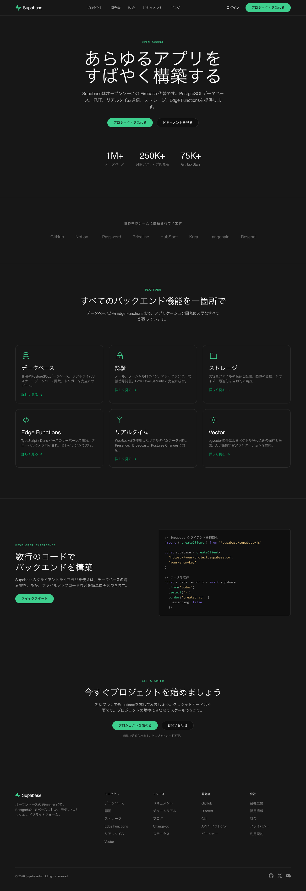</a><br><strong>Supabase</strong></td>
<td align="center"><a href="screenshots/superhuman.png">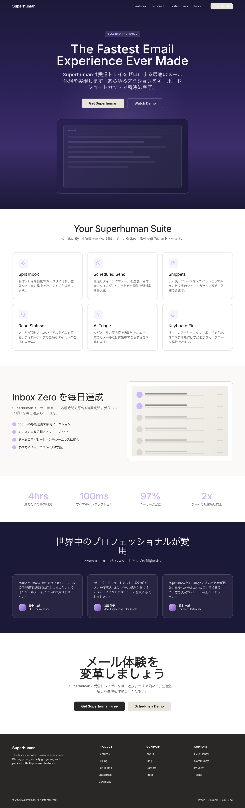</a><br><strong>Superhuman</strong></td>
<td align="center"><a href="screenshots/vercel.png"></a><br><strong>Vercel</strong></td>
</tr>
<tr>
<td align="center"><a href="screenshots/warp.png">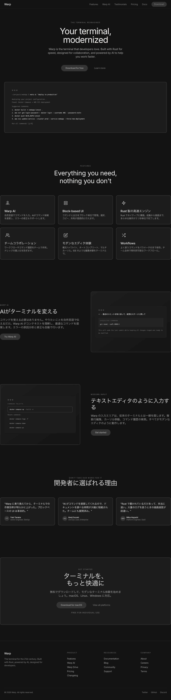</a><br><strong>Warp</strong></td>
<td align="center"></td>
<td align="center"></td>
<td align="center"></td>
</tr>
</table>
</details>

<details>
<summary><strong>Infrastructure & Cloud (6)</strong></summary>
<br>
<table>
<tr>
<td align="center" width="25%"><a href="screenshots/clickhouse.png">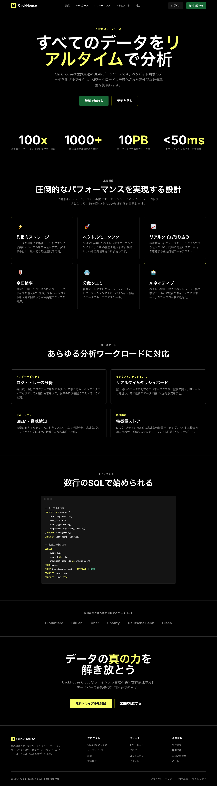</a><br><strong>ClickHouse</strong></td>
<td align="center" width="25%"><a href="screenshots/composio.png">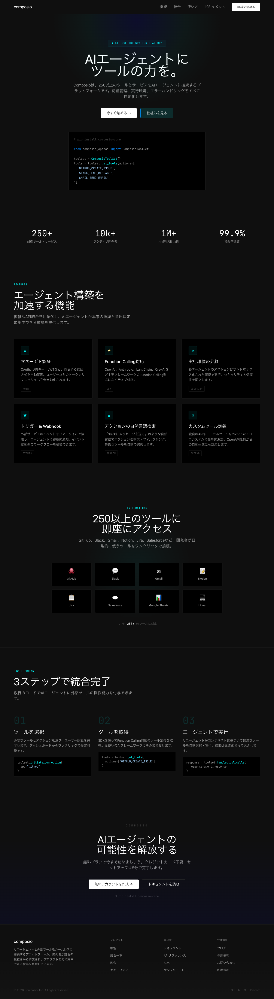</a><br><strong>Composio</strong></td>
<td align="center" width="25%"><a href="screenshots/hashicorp.png">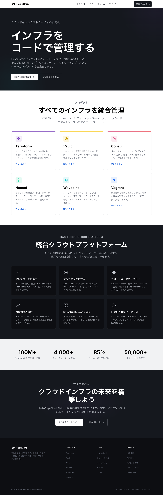</a><br><strong>HashiCorp</strong></td>
<td align="center" width="25%"><a href="screenshots/mongodb.png">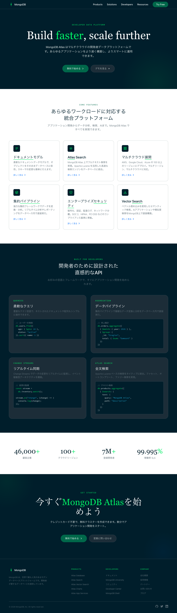</a><br><strong>MongoDB</strong></td>
</tr>
<tr>
<td align="center"><a href="screenshots/sanity.png">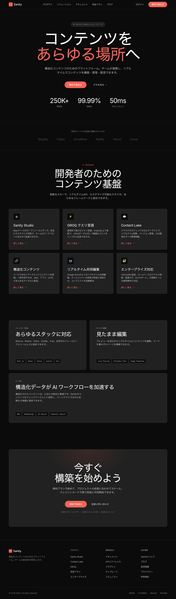</a><br><strong>Sanity</strong></td>
<td align="center"><a href="screenshots/stripe.png"></a><br><strong>Stripe</strong></td>
<td align="center"></td>
<td align="center"></td>
</tr>
</table>
</details>

<details>
<summary><strong>Design & Productivity (10)</strong></summary>
<br>
<table>
<tr>
<td align="center" width="25%"><a href="screenshots/airtable.png">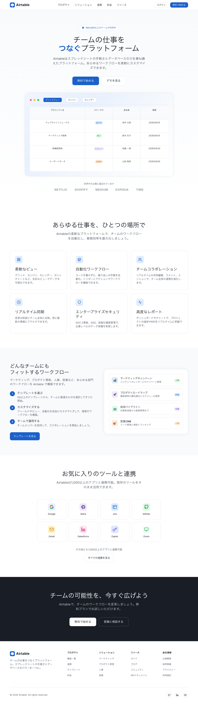</a><br><strong>Airtable</strong></td>
<td align="center" width="25%"><a href="screenshots/cal.png">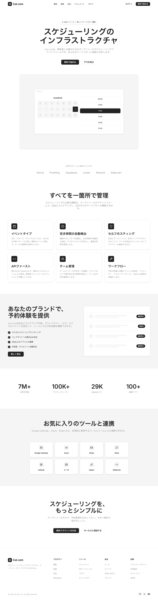</a><br><strong>Cal.com</strong></td>
<td align="center" width="25%"><a href="screenshots/clay.png">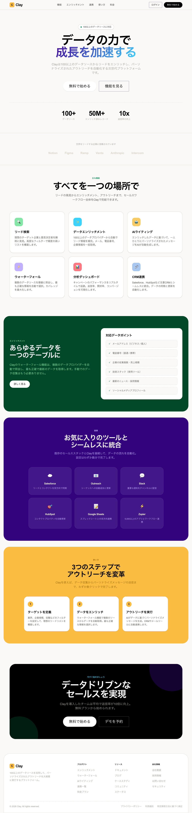</a><br><strong>Clay</strong></td>
<td align="center" width="25%"><a href="screenshots/figma.png"></a><br><strong>Figma</strong></td>
</tr>
<tr>
<td align="center"><a href="screenshots/framer.png">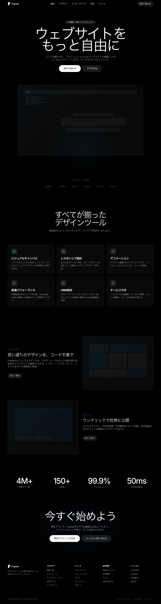</a><br><strong>Framer</strong></td>
<td align="center"><a href="screenshots/intercom.png">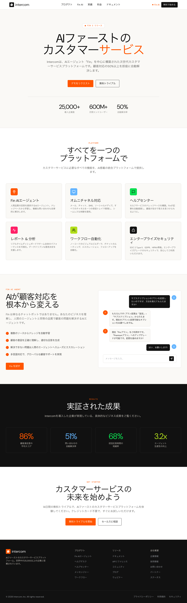</a><br><strong>Intercom</strong></td>
<td align="center"><a href="screenshots/miro.png">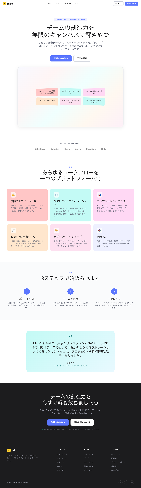</a><br><strong>Miro</strong></td>
<td align="center"><a href="screenshots/notion.png"></a><br><strong>Notion</strong></td>
</tr>
<tr>
<td align="center"><a href="screenshots/pinterest.png">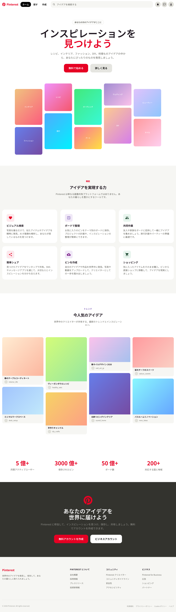</a><br><strong>Pinterest</strong></td>
<td align="center"><a href="screenshots/webflow.png">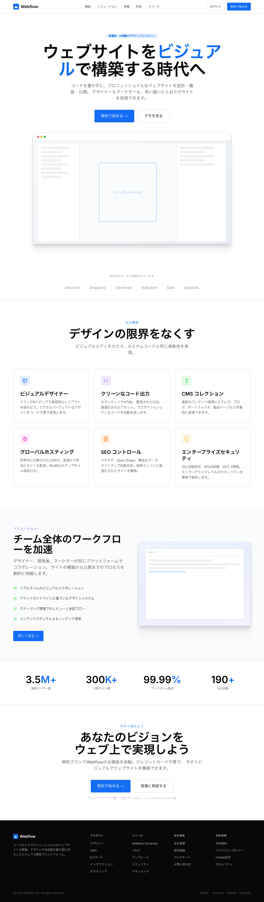</a><br><strong>Webflow</strong></td>
<td align="center"></td>
<td align="center"></td>
</tr>
</table>
</details>

<details>
<summary><strong>Fintech & Crypto (4)</strong></summary>
<br>
<table>
<tr>
<td align="center" width="25%"><a href="screenshots/coinbase.png">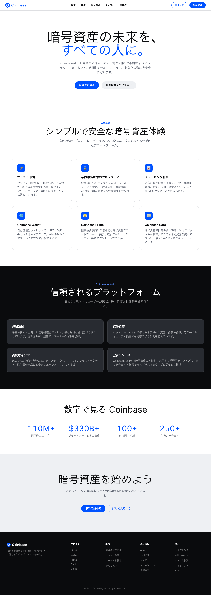</a><br><strong>Coinbase</strong></td>
<td align="center" width="25%"><a href="screenshots/kraken.png">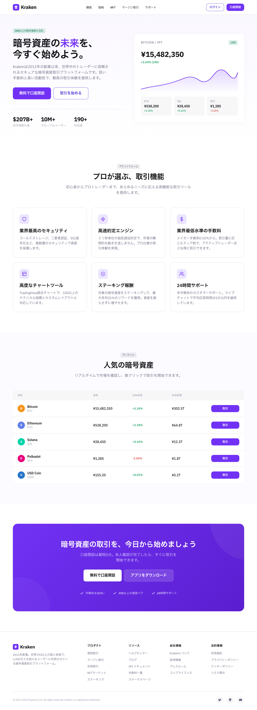</a><br><strong>Kraken</strong></td>
<td align="center" width="25%"><a href="screenshots/revolut.png">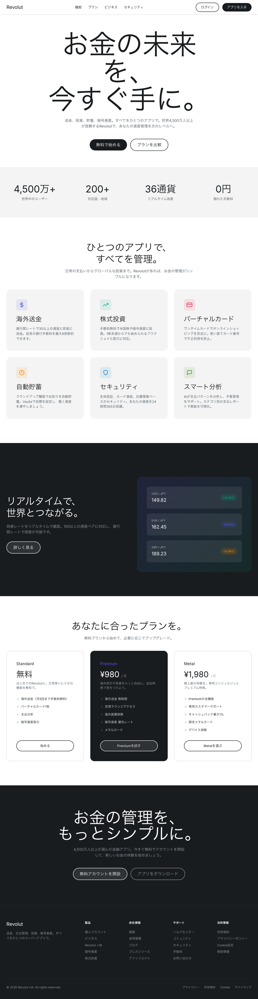</a><br><strong>Revolut</strong></td>
<td align="center" width="25%"><a href="screenshots/wise.png">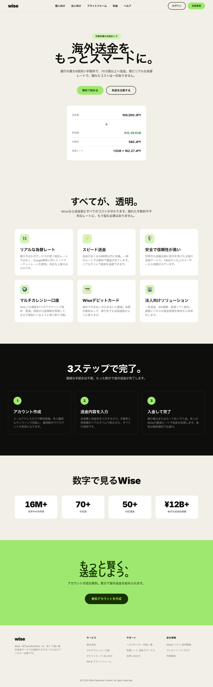</a><br><strong>Wise</strong></td>
</tr>
</table>
</details>

<details>
<summary><strong>Enterprise & Consumer (9)</strong></summary>
<br>
<table>
<tr>
<td align="center" width="25%"><a href="screenshots/airbnb.png"></a><br><strong>Airbnb</strong></td>
<td align="center" width="25%"><a href="screenshots/apple.png"></a><br><strong>Apple</strong></td>
<td align="center" width="25%"><a href="screenshots/bmw.png">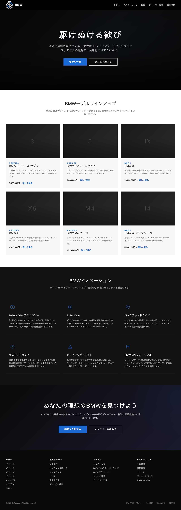</a><br><strong>BMW</strong></td>
<td align="center" width="25%"><a href="screenshots/ibm.png">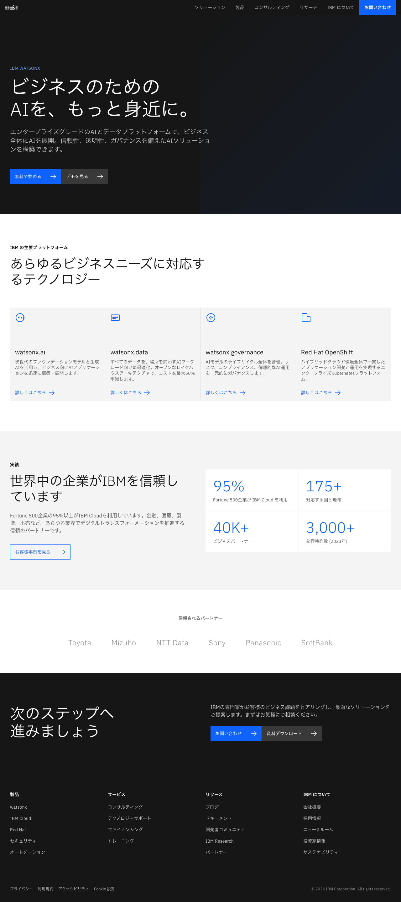</a><br><strong>IBM</strong></td>
</tr>
<tr>
<td align="center"><a href="screenshots/nvidia.png">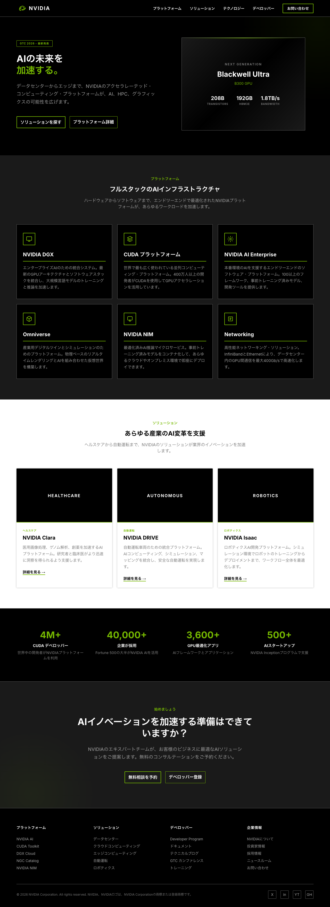</a><br><strong>NVIDIA</strong></td>
<td align="center"><a href="screenshots/spacex.png">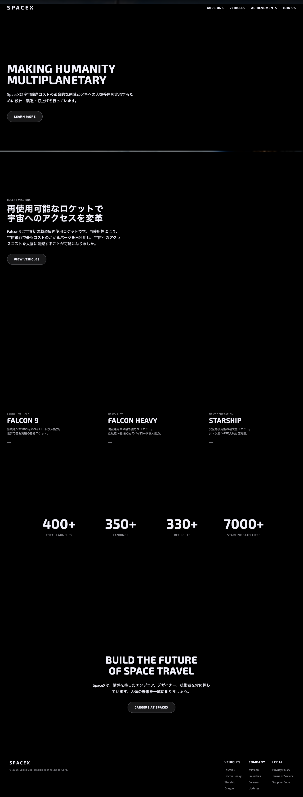</a><br><strong>SpaceX</strong></td>
<td align="center"><a href="screenshots/spotify.png"></a><br><strong>Spotify</strong></td>
<td align="center"><a href="screenshots/uber.png">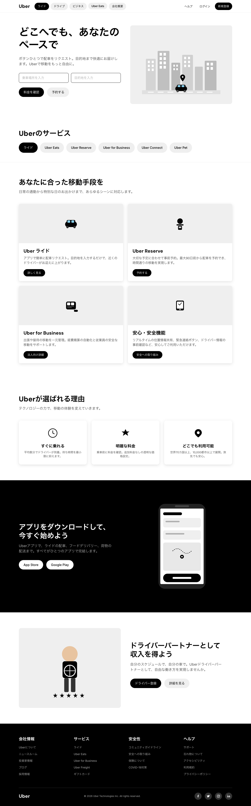</a><br><strong>Uber</strong></td>
</tr>
<tr>
<td align="center"><a href="screenshots/zapier.png">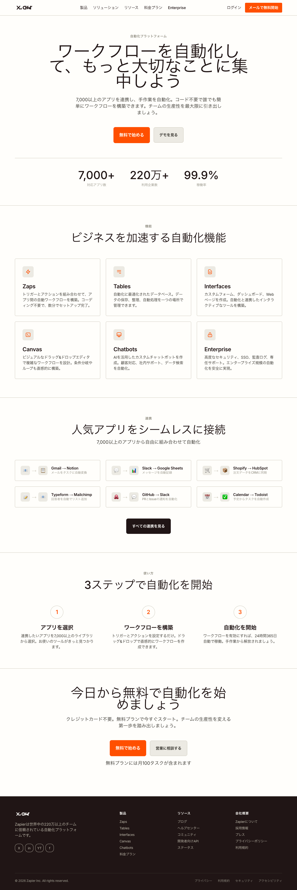</a><br><strong>Zapier</strong></td>
<td align="center"></td>
<td align="center"></td>
<td align="center"></td>
</tr>
</table>
</details>

## Project Structure

```
.
├── README.md
├── screenshots/          # 各サイトのフルページスクリーンショット
│   ├── apple.png
│   ├── stripe.png
│   └── ...
├── <site-name>/
│   ├── DESIGN.md         # デザインシステム定義（カラー、フォント、コンポーネント）
│   └── index.html        # 自己完結型のランディングページ
└── ...
```

各サイトディレクトリには以下の 2 ファイルが含まれています:

| ファイル | 説明 |
|----------|------|
| `DESIGN.md` | [awesome-design-md](https://github.com/VoltAgent/awesome-design-md) から取得したデザインシステム定義。カラーパレット、タイポグラフィ、コンポーネント仕様、スペーシング、レスポンシブ設計などを記述 |
| `index.html` | DESIGN.md のトークンを CSS Custom Properties で実装した、外部依存のない単一 HTML ファイル（Google Fonts のみ外部読み込み） |

## Getting Started

### サンプルサイトを閲覧する

```bash
# ブラウザで直接開く
open vercel/index.html

# または簡易サーバーで配信
npx serve .
```

### スクリーンショットを撮る

[agent-browser](https://github.com/vercel-labs/agent-browser) を使って、各サイトのフルページスクリーンショットを取得できます。

```bash
# agent-browser をインストール
npm install agent-browser

# Chrome for Testing をセットアップ
npx agent-browser install

# 1 サイトのスクリーンショットを取得
npx agent-browser open "file://$(pwd)/vercel/index.html"
npx agent-browser screenshot --full ./screenshots/vercel.png

# 全サイトを一括でスクリーンショット
for dir in */; do
  [ -f "$dir/index.html" ] || continue
  name="${dir%/}"
  npx agent-browser open "file://$(pwd)/$name/index.html"
  npx agent-browser screenshot --full "./screenshots/$name.png"
done
```

### 新しいサイトを追加する

1. [awesome-design-md](https://github.com/VoltAgent/awesome-design-md) から DESIGN.md を取得
2. 新しいディレクトリを作成し、DESIGN.md を配置
3. DESIGN.md のデザイントークンに基づいて `index.html` を作成
4. スクリーンショットを撮って `screenshots/` に保存

## Credits

- Design System Definitions: [VoltAgent/awesome-design-md](https://github.com/VoltAgent/awesome-design-md)
- Screenshot Tool: [vercel-labs/agent-browser](https://github.com/vercel-labs/agent-browser)
